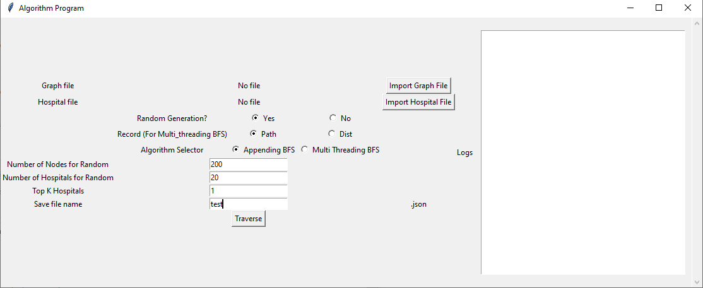

# Graph_Unweighted_Hospitals
For school algorithm lab project

## Run the gui.py file

This BFS algorithm project uses Appending BFS and Multi-threading BFS, which are implemented entirely without any references to online knowledge, other than the programming syntax and the basic BFS concept implementation.

### Input and Output

The Input files are self-imported anywhere from your computer and the program should handle any error if the input is wrong from the intended purposes.

The Output files are automatically saved into the output folder within the src file as .json format.
